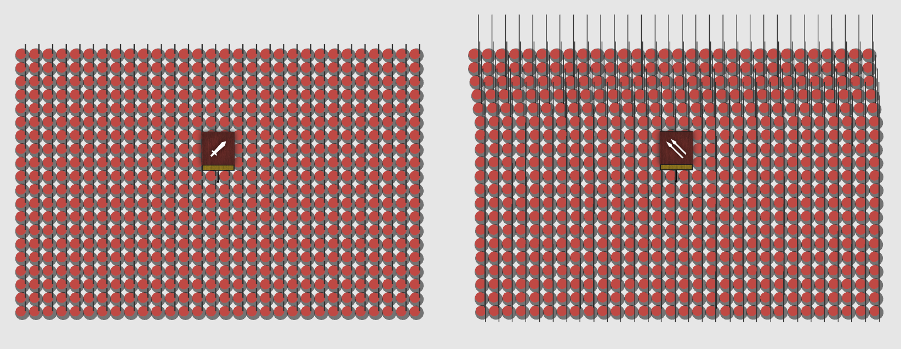
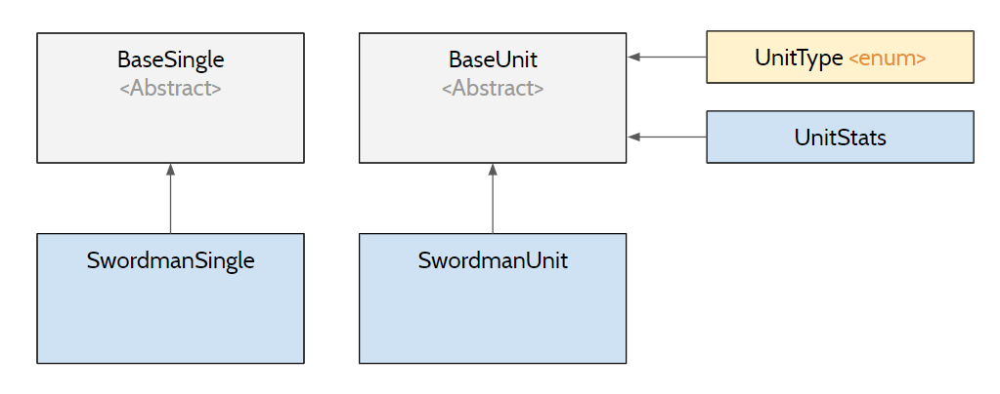

# Adding a new military unit to the game.

The process of adding a new unit in the game requires many changes. The design allows developers the ability to modify
unit behavior fairly quickly and efficiently, at the expense of slightly significant overhead in the creation stage.
This doc will describe what is considered a Unit in our system, what is the object design of the current unit system,
and what code change do you have to make to add to the Unit system.

## What is considered a unit?

A Unit in the game is defined as one group of solders having the same stats, move together in the battlefield, 
performing roughly the same functions.

For example, a `SWORDMAN` unit moves in rectangular formation and fight using melee sword. `PHALANX` unit also move in
a rectangular formation, but they hold spear and the first few rows are slightly offset by a small amount to mimic
the historical accuracy of this formation. An `ARCHER` unit can perform a range attack.


*Formation of the swordman and phalanx unit. Notice that the first few rows of the Phalanx unit is slightly left shifted.
These are the kind of differences that often require having a separate unit.*

Why is this definition important? That is because we want each Unit to be represented by a class, and that a new class
should only be created if there is a truly unique behavior that requires special implementation. If the two units have
completely similar behavior and only have minor difference, then they should be in the same class, with the difference
modifiable through a variable within `UnitStats`. For example, if we have a Gallic Swordman unit who has stronger
attack, stronger charge but weaker morale than the Roman Swordman unit, then they should belong to the same class
called `SwordmanUnit`, with a different `UnitStats` specifying different attack, charge and morale stats. In the next
part, we will dig deeper into the design of the class structure.

## Class structure of Unit.



The unit class is called `BaseUnit`, which contains all the basic functionality of the unit such as `updateIntention`,
`updateState`, `moveFormationKeptTo`, etc. A specific unit such as `SwordmanUnit` will extend from a `BaseUnit`. An extension /
inheritance means that the `SwordmanUnit` will inherit all the basic functionality mentioned without having to specify
its own.

Each soldier in a unit is represented by a class called `BaseSingle`, which contains basic functionality of a solder
such as `updateIntention`, `updateState`, `absorbOrject` etc. A specific single such as `SwordmanSingle`, similarly, will extend
from `BaseSingle` and inherit all the basic functionality of `BaseSingle`.

Why do we design like this? That is because each unit and single behaves very similar to each other, aside from very
minimal difference. If you want to create an `ArcherUnit`, you can simply inherit the `BaseUnit` class and all the basic
functionality such as moving in formation or update unit intention will already be implemented for you. You only need
to implement any behavioral difference in the `ArcherUnit` class.

So what methods are already given within `BaseSingle` and `BaseUnit` and what aren't? You can always check the project 
API (still under construction as of May 23, 2020). As of May 23, 2020, the two classes
contain the following basic methods.

`BaseUnit`:
* `moveFormationKeptTo(xGoal, yGoal, angleGoal)`: Move to a position specified at `xGoal` and `yGoal` and facing `angleGoal`,
but keep the current formation while moving.
* `uTurnFormation()`: Modify the troops order so that the unit will face the opposite direction.
* `deadMorph(deadSingle)`: If the single specified by `deadSingle` is killed in battle, modify the troops formation so
that other single will take the single's space and maintain a coherent front.
* `getBorderTroops()`: Get the troops who are at the border of the unit. This algorithm helps with collision checking.
* `getTroopsInPosition()`: This function will be deprecated
* `updateIntention()`: Update intention of the unit.
* `updateGoalPositions()`: Update the goal of each single within the unit.
* `updateState()`: Update the state of each unit, which also update the state of each single within the unit.
* `updateBoundingBox()`: Update the approximated bounding box of the unit. Used to speed up collision.
* `setInDanger()`: Update the boolean array specifing which troop is in danger of colliding with an enemy soldier.

`BaseSingle`:
* `updateIntention()`: Update the moving intention of the single.
* `updateState()`: Update the state of the single.
* `receiveDamage()`: Receive some amount of damage.
* `switchState(newState)`: Switch to a difference state.
* `absorbObject(object)`: The single can "absorb" the object so that the object stuck to them. This method is useful to
model the singles taking projectiles such as arrows.

You don't have to understand every single methods, just that these methods are automatically inherited when you extend 
a new Single class or Unit class. The two most important methods in these APIs are `updateIntetion()` and `updateState()`,
which we explains more carefully in another article here. We recommend you go through this article to understand the update
loop before we proceed.

## A new class with different behavior

So what if your new class does require a totally different behavior compared to a base class? For example, `PhalanxUnit`
might require a different `MoveFormationKeptTo(xGoal, yGoal, angleGoal)`, since we have mentioned that the first few rows of
phalanx are slightly offset. You might have also observed that there is no method for shooting at other units, so 
simply having `ArcherUnit` extending `BaseUnit` won't guarantee any shooting behavior. We will have to implement
these methods specifically for each class.

### Overloading methods

Overloading methods simply means you will rewrite the implementation in the specific class with the tag
`@Override`. For example.

```Java
// BaseUnit class
public class BaseUnit {
    public BaseUnit(...) { ... };
    public void moveFormationKeptTo(double xGoal, double yGoal, double angleGoal) { ... };
    ...
}

// PhalanxUnit class
public class PhalanxUnit { 
    public PhalanxUnit(...) { ... };
    
    @Override
    public void moveFormationKeptTo(double xGoal, double yGoal, double angleGoal) { ... };
    ...
}
```

So if something else called `moveFormationKeptTo` on a BaseSingle object, how does the system know which
method is referred to? This is the power of polymorphism in Java, and is one of the primary reasons why
Java is so powerful in projects like these. If your object has been initialized as a PhalanxUnit, the JVM
will *automatically* refer to you implementation in PhalanxUnit without you having to do anything. This way,
you don't have to edit any `moveFormationKeptTo` method that is already in place; the JVM will automatically use
the method that is specified for each Unit class, or defaulted to `BaseUnit`'s implementation if the specific
implementation is not found. Very neat!

### Implementing new methods

So what about a new method like shooting in `ArcherUnit`. In this case, you will need to implement your
`fireAtUnit(unit)` method specifically within `ArcherUnit`.

```Java
// BaseUnit class
public class BaseUnit {
    public BaseUnit(...) { ... };
    public void moveFormationKeptTo(double xGoal, double yGoal, double angleGoal) { ... };
    ...
}

// ArcherUnit class
public class ArcherUnit { 
    public ArcherUnit(...) { ... };
    
    public void fireAtUnit(BaseUnit unit) { ... };
    ...
}
```

Now, if in a different location, you are going through a list of `BaseUnit` and you want to perform a certain
`fireAtUnit(unit)` method, but only if the `BaseUnit` is an `ArcherUnit`, you will need to check for the class type
of the object, and the perform a *cast* to transform the object temporarily into an `ArcherUnit` to call this
`fireAtUnit(unit)` function. Simply call `fireAtUnit(unit)` directly off of `BaseUnit` won't work, because `BaseUnit`
has no knowledge of the `fireAtUnit(unit)` method implemented downstream.

```Java
public void shootAtUnit(BaseUnit shotUnit) {
    for (BaseUnit unit : units) {
        if (unit instanceof ArcherUnit) {
            ((ArcherUnit) unit).fireAtUnit(shotUnit);
        }       
    }
}
```

Notice that you don't have to cast `shotUnit`. Any unit can be shot at, but only `ArcherUnit` can fire
arrows!

Now that you understand the class structure of Unit and Single. Let's go to all the specific code changes
required for a new class in the current project (as of May 23)

## How to add a new class.

The list of steps needed to add a new class is as followed:

* Add a new Unit class in `src\model\units` extending from `BaseUnit`.
* Add a new Single class in `src\model\units` extending from `BaseSingle`.
* Modify the Single class in Unit initialization so that it refers to the new Single class that you created. For
example, you can see that during troops creation for `CatapultUnit`, the troop initialization refers to
the `CatapultSingle` class as below.

```java
/// CatapultUnit
public class CatapultUnit extends BaseUnit {
    public CatapultUnit(...) {
        ...
        troops = new ArrayList<>();
        for (int i = 0; i < unitSize; i++) {
            ...
            troops.add(new CatapultSingle(singleX, singleY, politicalFaction, this, singleStats, i, hasher));
        }
    }    
}
```


* Add a new unit type to `src\model\enums\UnitType.Java`. We recommend that each new Unit having a specific enum.
* Add your unit stats to `src\model\configs\game_configs/game_config.json`. Each `PoliticalFaction` will require one copy of the unit,
as we expect stats will be different for the same unit type in different factions. The config will look something like
the following.

```java
{
    // Type and faction information
    faction: ROME
    unit_type: CATAPULT  // Make sure this is the same as enum specified in UnitType

    // Single stats
    radius: 70
    speed: 0.2
    ...

    // Unit stats
    ...

    // Projectile stats
    ...

    // Catapult stats
    catapult_explosion_damage: 60
    catapult_explosion_range: 200
    ...
},
```

* Note that you might decided to add new stats for your unit. For example, `CatapultUnit` will require
`catapult_explosion_damage` and `catapult_explosion_range`, which is unique to Catapult, you will have to
handle reading these variables by modifying `readGameStats(filePath)` method within `src\utils\ConfigUtils.java`
as followed:

```java
public final class ConfigUtils {
    ...
    public static GameStats readGameStats(String filePath) throws IOException {
        ...
        SingleStats singleStats = new SingleStats();
        switch (unitType) {
            case ARCHER:
            ...
            case CATAPULT:  // Your new code here
                singleStats.catapultExplosionDamage = Double.parseDouble(d.get("catapult_explosion_damage"));
                singleStats.catapultExplosionRange = Double.parseDouble(d.get("catapult_explosion_range"));
                ...
                break;
            ...
        }
        ...

        UnitStats unitStats = new UnitStats();
        switch (unitType) {
            case ARCHER:
            ...
        }
    }
}
```

* You can see that you can either read into either `SingleStats` or `UnitStats`. You can store it wherever make sense
you. For example, since `catapult_explosion_damage` and `catapult_explosion_range` comes from each Catapult, we opt to
store these variables in `SingleStats`. For things like number of rows offset and the angle of offset for `PhalanxUnit`,
we store it in `UnitStats`. 
* Of course, this means that you will need to edit the `SingleStats` class in `src\model\singles\SingleStats.java` as
below:

```java
public class SingleStats {
    ...
    public double catapultExplosionDamage;
    public double catapultExplosionRange;
    
}
```

* `BaseSingle` holds a reference to the respective `SingleStats`, which is of course, inherited by `CatapultSingle`.
You can easily access these variables anywhere within `CatapultSingle`. As an example, we use these variables to make
the Catapult throw a `Stone` (what else does catapult do?):

```java
public class CatapultSingle extends BaseSingle {
    ...
    @Override
    public void updateIntention(Terrain terrain) {
        ...
        // Pick a random target
        shootingTarget = ((CatapultUnit) unit).pickNextTarget();
        
        // Don't fire target if there is nothing to fire at.
        if (shootingTarget == null) break;
        
        // Throw a stone into the shooting target
        hasher.addObject(new Stone(x, y, shootingTarget.getX(), shootingTarget.getY(),
                singleStats.catapultSpeed,
                singleStats.catapultDamage,
                singleStats.catapultExplosionDamage,
                singleStats.catapultExplosionRange,
                singleStats.catapultExplosionPush,
                singleStats.catapultPushForce,
                singleStats.angleVariation));
        ...
    }
}
```

* Finally, you will have to modify `readBattleConfigs(...)` in `src\utils\ConfigUtils.java` so that the CatapultUnit
is actually initialized when read from a battle configuration.

```java
public final class ConfigUtils {
    public static ArrayList<BaseUnit> readBattleConfigs(...) throws IOException {
        ...
        BaseUnit unit;
        switch (unitType) {
            ...
            case CATAPULT:
                unit = new CatapultUnit(x, y, angle, unitSize, faction, unitStats, singleStats, unitWidth, hasher, terrain, broadcaster);
                break;
        }
    }
}
```

This guide only serves as a list of minimum changes you need to implement to get your new class of Unit up and running.
As you can see, adding a new Unit can be a significant undertaking, especially when new functionality are involved. We
haven't even mentioned that in the case of `CatapultUnit` class in particular, you will have to add the `Stone`
class and modifies the physics model itself! We will write a specific guide if you want to implement a new Projectile throwing class
(like `CatapultUnit` or `ArcherUnit`) or if you would like your Unit to have a specific graphics.

Therefore, it is always recommended that you do a careful design review before writing code to have a higher chance of a 
successful pull request. Feel free to email me at `son.pham@bucknell.edu` so that we can discuss any new unit classes
you want to implement, or any new ideas you might have about our current system.

