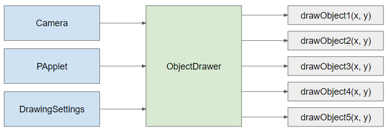

# Drawing Guide

The software package has many drawers in order to make managing and drawing more convenient. The drawing system works as
followed:

Each object drawer often specializes in drawing a specific object. We currently have the following specialized drawer:

* `InfoDrawer`: Draw information tracking components on screen for the purpose of debugging.
* `MapDrawer`: Draw the map.
* `ShapeDrawer`: Draw the shape of objects in the game such as troops, arrows, etc.
* `UIDrawer`: Draw UI components.

Each object drawer takes a PApplet, a Camera and a DrawingSettings, while provide a range of drawing methods to draw
specific objects. The is a very nice design because:

* By taking in Camera, PApplet and Drawing settings, the draw method can just refer to these objects internally without
repetitively have to put them in the draw methods. The draw method can just contain relevant information for the draw.
* ObjectDrawer can store internal optimization variables for the drawing, but abstracting those details from the
outside.
* Each draw object can simply take in position (x, y) as the actual position of the object, instead of having to
consider where it is in the camera.